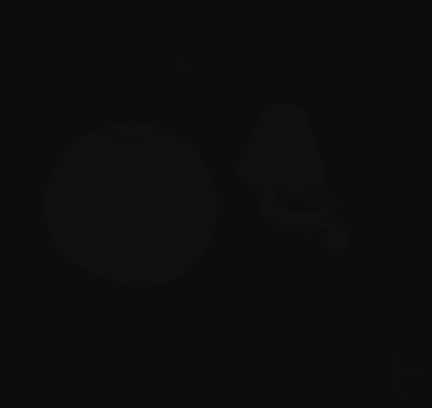
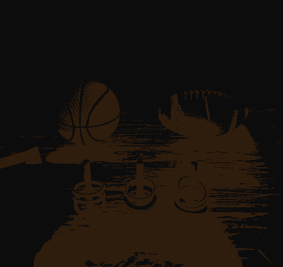

# Lighting Shader Program with PyOpenGL

## Introduction

To begin, I utilized five different surface shapes such as spheres, ellipsoids, rectangles, cones (cylinders), and torus (donut shapes). I wrote my own code for creating the surface mesh and defining the vertex buffer and index buffer. I then implemented various rendering techniques, including basic rendering, diffuse reflection, specular reflection, ambient lighting, texture mapping, and normal mapping. I also distinguished between point lighting, directional lighting, and spotlight effects. Ultimately, I produced several stunning scenes.

The following are the four scenarios of this program:

## Usage

| Keys                      | Functions                                                    |
| ------------------------- | ------------------------------------------------------------ |
| Numeric keys (`1` to `9`) | Toggle the light switches in the scene (if the corresponding number exists) |
| `A`                       | Turn on/off the ambient rendering mode.                      |
| `S`                       | Turn on/off the specular rendering mode.                     |
| `D`                       | Turn on/off the diffuse rendering mode.                      |
| `←` / `→`                 | Switch scenes.                                               |

## Scene design

*   **Scene 1:** An earth globe with a normal map, a marble ring with a normal map, and a highlighted cone.

    

*   **Scene 2:** A scene similar to Phasmophobia, with a wooden floor (with a normal map), several flashlights, a basketball (with a normal map), an American football (with a normal map), and several ropes loops.

    

*   **Scene 3:** A beautiful Christmas table with lots of delicious donuts, cakes, and gift boxes. Using very rich lighting effects.

    

*   **Scene 4:** This is a finely crafted scene featuring a pool table with a smooth, comfortable texture and an orderly pattern of stripes. A series of pool balls and a rack are placed on the table. Four flashlight beams illuminate the center of the table and two fluorescent lamps are used for lighting. In this scene, I used a normal map to achieve the feel of the fabric on the pool table. The fluorescent lamps use an infinite light and the flashlight beams use a spotlight effect.

    https://user-images.githubusercontent.com/17313035/211105179-6839973b-d054-4b16-8123-666d354238b8.mp4

## Features Included

| Requirements                                                           | Done |
| ---------------------------------------------------------------------- | ---- |
| Generate Triangle Meshes: Ellipsoid, Torus, and Cylinder with end caps | √    |
| Implement EBO for defining your meshes                                 | √    |
| Generate normals for your meshes, and implement normal visualization   | √    |
| Illuminate your meshes with diffuse, specular, and ambient components  | √    |
| Support 3 different light types (point, infinite, spotlight)           | √    |
| Create 3 different scenes                                              | √    |
| Texture mapping                                                        | √    |
| Normal mapping                                                         | √    |
| Artist Rendering                                                       |      |
