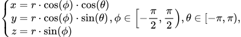
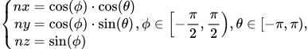
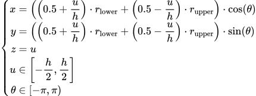
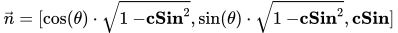
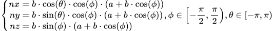
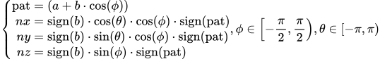

# Lighting Shader Program with PyOpenGL

## Introduction

To begin, I utilized five different surface shapes such as spheres, ellipsoids, rectangles, cones (cylinders), and torus (donut shapes). I wrote my own code for creating the surface mesh and defining the vertex buffer and index buffer. I then implemented various rendering techniques, including basic rendering, diffuse reflection, specular reflection, ambient lighting, texture mapping, and normal mapping. I also distinguished between point lighting, directional lighting, and spotlight effects. Ultimately, I produced several stunning scenes.

The following are the four scenarios of this program:

## Instructions for running the program:

1. First, please install version 3.8 of Python or install Anaconda/Miniconda.
   - If you choose conda, please use `conda create -n GRAPHICS` after installation to create an environment named GRAPHICS. Then use `conda activate GRAPHICS` to enter that environment.
2. Use `pip install -r requirements.txt` to install the required packages: PyOpenGL, WxPython, and Numpy.
3. Run the program by executing the command `pythonw Sketch.py`

   > On Mac, please use `python.app`.

If you encounter any problems during the run, please submit an Issue.

## Demo video:

https://user-images.githubusercontent.com/17313035/212208470-92e19a14-d740-4b26-acf5-eb7b32769340.mp4

## Usage

| Keys                      | Functions                                                    |
| ------------------------- | ------------------------------------------------------------ |
| Numeric keys (`1` to `9`) | Toggle the light switches in the scene (if the corresponding number exists) |
| `A`                       | Turn on/off the ambient rendering mode.                      |
| `S`                       | Turn on/off the specular rendering mode.                     |
| `D`                       | Turn on/off the diffuse rendering mode.                      |
| `←` / `→`                 | Switch scenes.                                               |

## Scene design

*   **Scene 1:** This scene is a testing scene, primarily used to ensure that the VBO/EBO implementation of this program is functioning correctly. It includes an 🌏 earth (sphere shape), a ring ashtray (torus shape), and a half cone, all with metallic surface applied. There are also three point lights present in the scene, colored blue, red, and yellow, that are flying around.

    https://user-images.githubusercontent.com/17313035/212064222-db4851d7-4e9e-4dc1-a0af-b4e6e1c57a47.mp4

*   **Scene 2:** The second scene is similar to the high school map in the game [Phasmophobia](https://web.archive.org/web/20230109084122/https://kineticgames.co.uk/). It features a wooden floor of a basketball court, on which there is a 🏀basketball (sphere model), an 🏈 American football (ellipsoid model), several rings (randomly colored red or blue, torus model for the ring, cylinder model for the stick). In order to create a horror-like atmosphere, I intentionally made the environment dark and added several 🔦 flashlights, to create a atmosphere of dimness.

    https://user-images.githubusercontent.com/17313035/212064238-2ee8cbd5-9ddc-44ee-9d36-cb33d7907e71.mp4

*   **Scene 3:** The third scene is a beautifully set dining table with a plethora of donuts 🥯 (All come in Glazed flavor, which is my favorite flavor. You might gain 10lbs if you ate them all 😂lol), several nicely decorated 🎁 Christmas gift boxes, chocolate cakes and elegant candles. The surface of the Christmas gift box has a reflective mirror-like effect (resembling tin foil). The donuts are textured using a special normal map that makes them look incredibly realistic! (The specific texture file can be found in the /assets folder). The only downside is that I didn't implement a shadow effect, so the candle light will shine through the cakes and it will give the impression of a very bright light beneath the cakes.

    https://user-images.githubusercontent.com/17313035/212064275-05d1bb5b-6b4f-4353-bf17-936dba0c32cc.mp4

*   **Scene 4:** This is a finely crafted scene featuring a 🎱 pool table with a smooth, comfortable texture and an orderly pattern of stripes. A series of pool balls and a rack are placed on the table. Four flashlight beams illuminate the center of the table and two fluorescent lamps are used for lighting. In this scene, I used a normal map to achieve the feel of the fabric on the pool table. The fluorescent lamps use an infinite light and the flashlight beams use a spotlight effect.

    https://user-images.githubusercontent.com/17313035/212064318-96b759c7-e3f0-4d7c-bd7f-f892211f04a8.mp4

## Model Design

The following models are used in this program:

1. Sphere/Ellipsoid Model

   Sphere surface parameter equation, where $r$ represents the radius of the sphere.

   
   
   <!--$$
   \left \{
   \begin{aligned}
   x &= r \cdot \cos(\phi) \cdot \cos (\theta) \\
   y &= r \cdot \cos(\phi) \cdot \sin (\theta) \\
   z &= r \cdot \sin(\phi) \\
   \end{aligned}
   \right.,
   \phi \in \left[-\frac{\pi}{2}, \frac{\pi}{2}\right),
   \theta \in \left[-\pi, \pi\right),
   $$-->

   Normal equation:

   
   

<!--$$
   \left \{
   \begin{aligned}
   nx &= \cos(\phi) \cdot \cos (\theta) \\
   ny &= \cos(\phi) \cdot \sin (\theta) \\
   nz &= \sin(\phi) \\
   \end{aligned}
   \right.,
   \phi \in \left[-\frac{\pi}{2}, \frac{\pi}{2}\right),
   \theta \in \left[-\pi, \pi\right),
$$-->

   Texture mapping position: Each point `[j/stacks, i/slices]`. Where `j/stacks` represents the iteration of $\theta$ and `i/slices` represents the iteration of $\phi$. See [DisplayableSphere.py](DisplayableSphere.py) for specific definitions.

   The parameters of the ellipsoid model are very similar to those of the sphere model, with the only difference being that $r$ is replaced with $a$, $b$, and $c$, which represent the three different radius of the ellipsoid. See [DisplayableEllipsoid.py](DisplayableEllipsoid.py) for specific definitions.

2. Cube Model

   The cube model has a total of 8 points, and different faces have different normals, all of which need to be defined manually. Please refer to [DisplayableCube.py](DisplayableCube.py) for specific VBO/EBO definitions, as they will not be explained here.

3. Cylinder/Cone Model

   Surface parameter equation:

   <!--$$
   \newcommand{\low}{{r_{\mathrm{lower}}}}
   \newcommand{\upp}{{r_{\mathrm{upper}}}}
   \left \{
   \begin{aligned}
   x &= \left(\left(0.5 + \frac{u}{h}\right) · \low + \left(0.5 - \frac{u}{h}\right) · \upp \right) · \cos(\theta) \\
   y &= \left(\left(0.5 + \frac{u}{h}\right) · \low + \left(0.5 - \frac{u}{h}\right) · \upp \right) · \sin(\theta) \\
   z &= u \\
   u &\in \left[-\frac{h}{2}, \frac{h}{2}\right] \\
   \theta &\in \left[-\pi, \pi\right)
   \end{aligned}
   \right.
   $$-->
   
   

   where $r_{\mathrm{lower}}$ represents the lower radius of the cone, $r_{\mathrm{upper}}$ represents the upper radius of the cone. If the two radii are the same, it represents a cylinder. $h$ is the height.

   Normal equation:

   - On the top surface is: $\vec{n}=[0, 0, 1]$

   - On the bottom surface is: $\vec{n}=[0, 0, -1]$

   - On the edges is:
     <!--$$
     \newcommand{\csin}{{\mathbf{cSin}}}
     \vec{n}=[\cos(\theta) · \sqrt{1 - \csin^2}, \sin(\theta) · \sqrt{1 - \csin^2}, \csin]
     $$-->
     
     
     
     where, $\mathbf{cSin} = (r_{\mathrm{lower}} - r_{\mathrm{upper}}) / h$.
     

   See [DisplayableCylinder.py](DisplayableCylinder.py) for specific definitions.

4. Torus Model

   Torus surface parameter equation:
   
   <!--$$
   \left \{
   \begin{aligned}
   x &= (a + b \cdot \cos(\phi)) \cdot \cos (\theta) \\
   y &= (a + b \cdot \cos(\phi)) \cdot \sin (\theta) \\
   z &= b \cdot \sin(\phi) \\
   \end{aligned}
   \right.,
   \phi \in \left[-\frac{\pi}{2}, \frac{\pi}{2}\right),
   \theta \in \left[-\pi, \pi\right),
   $$-->
   
   
   
   where `a = (outer + inner) / 2`, `b = (outer - inner) / 2`.

   Torus surface normal equation:

   <!--$$
   \left \{
   \begin{aligned}
   nx &= b · \cos(\theta) · \cos(\phi) · (a + b · \cos(\phi)) \\
   ny &= b · \sin(\theta) · \cos(\phi) · (a + b · \cos(\phi)) \\
   nz &= b · \sin(\phi) · (a + b · \cos(\phi)) \\
   \end{aligned}
   \right.,
   \phi \in \left[-\frac{\pi}{2}, \frac{\pi}{2}\right),
   \theta \in \left[-\pi, \pi\right)
   $$-->
   
   

   After normalization it is:

   <!--$$
   \DeclareMathOperator{\sign}{sign}
   \DeclareMathOperator{\pat}{pat}
   \left \{
   \begin{aligned}
   \pat &= (a + b · \cos(\phi))\\
   nx &= \sign(b) · \cos(\theta) · \cos(\phi) · \sign(\pat) \\
   ny &= \sign(b) · \sin(\theta) · \cos(\phi) · \sign(\pat) \\
   nz &= \sign(b) · \sin(\phi) · \sign(\pat) \\
   \end{aligned}
   \right.,
   \phi \in \left[-\frac{\pi}{2}, \frac{\pi}{2}\right),
   \theta \in \left[-\pi, \pi\right)
   $$-->
   
   

   Texture mapping position: Each point `[i/nsides, j / rings]`. Where `i/nsides` represents the iteration of $\theta$ and `j / rings` represents the iteration of $\phi$. See [DisplayableTorus.py](https://chat.openai.com/DisplayableTorus.py) for specific definitions.

## Features Included

| Requirements                                                           | Done |
| ---------------------------------------------------------------------- | ---- |
| Generate Triangle Meshes: Ellipsoid, Torus, and Cylinder with end caps | ✅    |
| Implement EBO for defining your meshes                                 | ✅    |
| Generate normals for your meshes, and implement normal visualization   | ✅    |
| Illuminate your meshes with diffuse, specular, and ambient components  | ✅    |
| Support 3 different light types (point, infinite, spotlight)           | ✅    |
| Create 3 different scenes                                              | ✅    |
| Texture mapping                                                        | ✅    |
| Normal mapping                                                         | ✅    |
| Artist Rendering                                                       |      |
